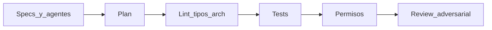
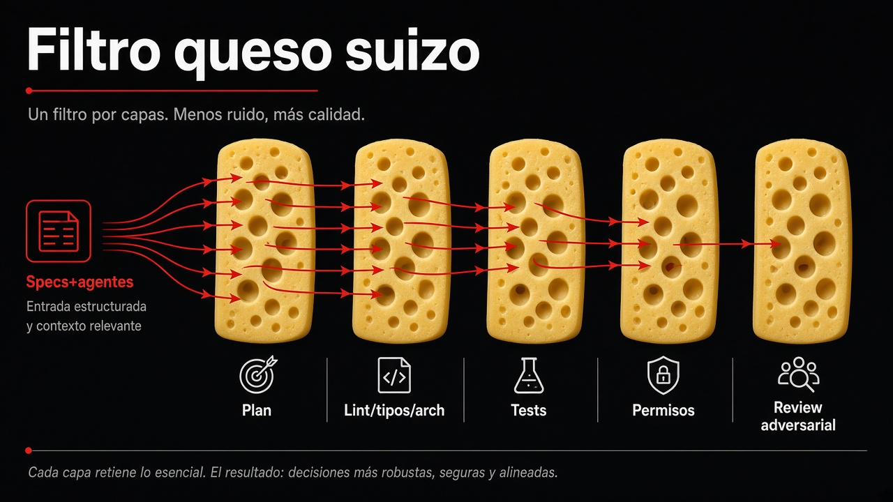

# AGENTS.md

Jakala Talks: proponer y votar charlas. Next.js 16 App Router + React 19 + TypeScript + Supabase (Postgres + Google OAuth). Hexágono en `src/`. Node commands: `yarn`.

## Filtro queso suizo

Confianza en agentes = varias capas. Cada una caza un tipo de error. Ninguna sola basta. Specs + agentes (hexágono, rules always-on) entran por la izquierda.





| Capa | Disparador |
|---|---|
| **Plan** | Feature/arquitectura → Plan mode. Stress-test → skill `grilling` |
| **Lint / tipos / arch** | `yarn lint`, `yarn typecheck`, `yarn lint:arch` (pre-push + CI) |
| **Tests** | Skill `tdd` + `yarn test`. Feature nueva = unit + integración |
| **Permisos** | No secretos. No URL/keys de **prod** en `.env.local`. Migraciones solo si el schema está pedido. No crear `middleware.ts` |
| **Review adversarial** | Tras feature/PR local → skill `code-review` |

Local sin contaminar prod: UI = `yarn dev` (MSW intercepta Supabase). Backend real = `NEXT_PUBLIC_USE_SUPABASE=true` + Supabase local o proyecto de **dev**, nunca prod en `.env.local`.

Profundidad (scripts, MSW, fuera de alcance) → `.cursor/docs/HARNESS.md`.

## Mapa

| Path | Qué hay |
|---|---|
| `src/domain` | Entidades, VOs, puertos |
| `src/application/services` | Casos de uso |
| `src/infrastructure/adapters` | Impl. de puertos (Supabase + InMemory) |
| `lib/` | Composition root: clients Supabase, factories, MSW boot, env |
| `app/` | App Router. No `pages/` |
| `components/` | UI React |
| `supabase/migrations/` | Schema real |
| `.cursor/docs/` | Onboarding, env, harness |
| `docs/agents/` | Tracker (`issue-tracker.md`) y how-to de `/deliver` (`deliver.md`) |

Alias: `@/*` → raíz del repo.

## Convenciones que el árbol no grita

**Composition.** UI y `app/` piden repos a `*Factory` en `lib/repositories/`. No instanciar adaptadores a mano fuera de factory o test.

**Dos impls de puerto, MSW en el cable.** Factories de runtime siempre `TalkRepository` / `Supabase*` (HTTP). En `yarn dev` MSW intercepta salvo `NEXT_PUBLIC_USE_SUPABASE=true`. `InMemory*` = tests. Integración: caso de uso + InMemory. `yarn dev:mock` = alias de `yarn dev`.

**Auth.** Supabase OAuth directo, no NextAuth. `NEXTAUTH_URL` es solo URL de la app (nombre legado). Callback: `app/auth/callback`. Edge session: `proxy.ts` (Next 16). No crear `middleware.ts`.

**UI.** Un componente = carpeta `Name/Name.tsx` + `Name.styles.ts` (styled-components) + `index.ts` + `__tests__/`. Tailwind vive en `app/globals.css`, no sustituye `.styles.ts`.

**Tests.** Colocados: `foo/__tests__/foo.test.ts`. Integración: `*.integration.test.ts` al lado del caso de uso. No hay carpeta `tests/`. Feature nueva o cambiada lleva unit + integración.

**Dominio.** Errores de negocio en español. `Talk`: título ≤50, descripción ≤400. Votos: recuento derivado de `user_votes` vía RPC `get_talk_vote_counts`, no columna en `talks`. Schema: editar migraciones, no el SQL del README.

**Votación.** Fases `waiting → proposing → voting → closed`. Crear charla solo en `waiting`/`proposing`. Votar solo en `voting` y bajo `maxVotesPerUser`. `VoteTalk` es toggle (votar/desvotar). Fechas y cupo: `src/domain/valueObjects/VotingRules.ts`.

## Cuándo leer qué

- Onboarding, `yarn dev`, Google OAuth, Site URL, Redirect URLs, login roto en prod, deploy → `.cursor/docs/ONBOARDING.md`
- Qué significa cada variable de `.env.example` → `.cursor/docs/VARIABLES_ENTORNO.md`
- Harness (gates, MSW, fuera de alcance) → `.cursor/docs/HARNESS.md`
- Tracker de issues (spec/tickets, label `ready-for-agent`) → `docs/agents/issue-tracker.md`
- Lanzar `/deliver` y qué produce → `docs/agents/deliver.md`
- Hexágono, puertos, DI, nada de SDK en domain/application → `.cursor/rules/arquitectura/`
- Estrategia de tests → `.cursor/rules/testing/`
- Schema y RLS → `supabase/migrations/`
- Casos de uso actuales: `GetAllTalks`, `CreateTalk`, `VoteTalk`, `GetUserVotes`

## Arranque

```bash
yarn install
yarn dev           # MSW intercepta Supabase (UI sin backend)
yarn lint          # ESLint + jsx-a11y
yarn typecheck     # tsc --noEmit
yarn lint:arch     # dependency-cruiser (hexágono)
yarn test          # Jest + Testing Library
```

`yarn dev` usa MSW salvo `NEXT_PUBLIC_USE_SUPABASE=true`. Backend real: `.env.local` (copia de `.env.example`) apuntando a **dev**, nunca a prod. Pre-push Husky: `yarn lint` + `yarn lint:arch` + `yarn test` + `yarn build`. CI: mismos gates + `typecheck`.
